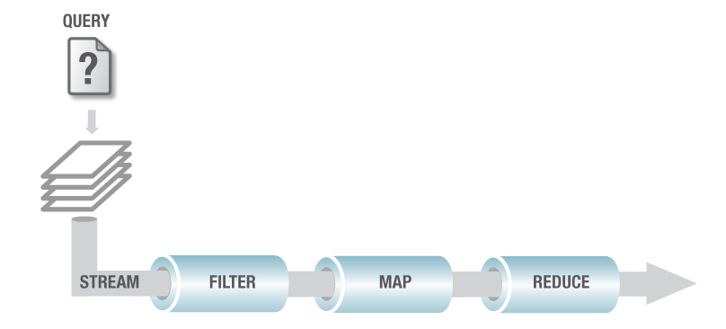

#Query with Multiple Filters
##Problem
You want to authenticate a username and password stored in Aerospike and need to query Aerospike with multiple predicates.
##Solution
The solution is to use a query on a secondary index on the username Bin and add a “filter” on the output of the query that filters records based on the password Bin.  
##Getting the Code
The code for this example is in GitHub: https://github.com/aerospike/query-with-filters.

Clone the GitHub repository using the following command:
```
git clone https://github.com/aerospike/query-with-filters.git
```
##Running the Example
There are two ways to run this example: one way is through code where the data is loaded, indexed and the query is all executed using either Java code via the [Aerospike Java Client](http://www.aerospike.com/docs/client/java/) API or C code via the [Aerospike C Client](http://www.aerospike.com/docs/client/c/) API. The other way is via [Aerospike Query Language](http://www.aerospike.com/docs/tools/aql/) (AQL), which is an SQL like language that is executed with the AQL utility.
###Using AQL
To load the test data using AQL and execute the example, use the following command on a Linux machine where Aerospike is installed:
```
aql -f aql/AuthenticateTest.aql
```
The AQL script ```AuthenticateTest.aql``` is in the subdirectory "aql". This file contains AQL that creates a secondary index, inserts data, registers the StreamUDF package and executes the aggregation query.
####Output
```sql
# aql -f aql/AuthenticateTest.aql
RUN 'aql/AuthenticateTest.aql'
REGISTER module 'udf/profile.lua'
OK, 1 module added.
CREATE INDEX profileindex ON test.profile (username) STRING
INSERT INTO test.profile (PK, username, password) VALUES ('1', 'Charlie', 'cpass')
OK, 1 record affected.
INSERT INTO test.profile (PK, username, password) VALUES ('2', 'Bill', 'hknfpkj')
OK, 1 record affected.
INSERT INTO test.profile (PK, username, password) VALUES ('3', 'Doug', 'dj6554')
OK, 1 record affected.
INSERT INTO test.profile (PK, username, password) VALUES ('4', 'Mary', 'ghjks')
OK, 1 record affected.
INSERT INTO test.profile (PK, username, password) VALUES ('5', 'Julie', 'zzxzxvv')
OK, 1 record affected.
SELECT * FROM test.profile WHERE username = 'Mary'
1 rows in set (0.004 secs)
AGGREGATE profile.check_password('ghjks') ON test.profile WHERE username = 'Mary'
+-----------------------------------------+
| check_password                          |
+-----------------------------------------+
| {"username":"Mary", "password":"ghjks"} |
+-----------------------------------------+
1 row in set (0.003 secs)
```
###Using Java Code
The Java code, that does the same as the AQL, is located under the "src" subdirectory. This code can be built with the maven command:
```
mvn clean package
```
The maven will build a runnable JAR in the target directory ```query-with-filters-3.0.22-jar-with-dependencies.jar```.
 
You can run this jar with the following command:
```
java -jar target/query-with-filters-3.0.22-jar-with-dependencies.jar
```
####Options
```
-h,--host <arg>  Server hostname (default: localhost)
-p,--port <arg>  Server port (default: 3000)
-u,--usage       Print usage
```
####Output
```
$ java -jar target/query-with-filters-3.0.22-jar-with-dependencies.jar 
0 INFO  AuthenticateTest  -  Host: 127.0.0.1
1 INFO  AuthenticateTest  -  Port: 3000
register udf/profile.lua
create index profileindex
add records
query on username
Record: (gen:5),(exp:200894880),(bins:(password:ghjks),(username:Mary))
query for Mary
Result: {password=ghjks, username=Mary}
```

###Using C Code
This library depends on the Aerospike C library, you can either download the demo package from the Aerospike [website](http://www.aerospike.com/docs/client/c/) or you can go to [GitHub](https://github.com/aerospike/aerospike-client-c) to install and follow the instructions. 
The C code, that does the same as AQL and Java, is located under the "c" subdirectory.
For simplicity, the Makefile assumes Lua is the default one that is included in ```aerospike.a``` library, if you want to have a different kind of Lua included please go see [Aerospike C Client](http://www.aerospike.com/docs/client/c/).
This code can be built with:
```
make
```

####Options
```
./target/example -u
-h host       [default: 127.0.0.1]
-p port       [default: 3000]
-U username   [default: none]
-P [password] [default: none]
-n namespace  [default: test]
-s set name   [default: profile]
```

####Output
```
host     : 127.0.0.1
port     : 3000
user     : 
namespace: test
set name : profile

register ../udf/profile.lua
create index profileindex
insert records
insert succeeded
read records
read succeeded

executing query where username = Mary
query callback returned record:
  generation 1, ttl 432000, 2 bins:
  username : "Mary"
  password : "ghjks"
query is complete

executing filter query where password = ghjks
query callback returned {"username":"Mary", "password":"ghjks"}
query is complete

query with multiple filters example successfully completed
```

###UDF Package Registration
The Lua UDF package "profile.lua" containing the StreamUDF is located in the "udf" subdirectory. It is registered with the cluster by the AQL, the Java code or the C code. 
Registering a UDF package with a cluster checks the syntax of the package and loads it onto all nodes in the cluster. 

##Discussion
You can do complex queries using Aerospike. They can be as simple as Primary Key operations; more complex secondary index queries; or very sophisticated Aggregations.

Aerospike secondary index queries operate on the indexed Bin. You can perform equality queries on Strings:
```sql
WHERE username = 'bob'
```
or range queries on integers:
```sql
WHERE age between 25 AND 34
```
but only a single predicate.

Although a large set of data can be requested and filtered in the client application, Aerospike allows creation of very arbitrary and flexible filters using [User Defined Functions](https://www.aerospike.com/docs/udf/udf_guide.html). These filters are executed on the server, thereby saving the network trip to the client application and allowing the extension of the database to very arbitrary use cases. 

This feature is called [Aggregations](http://www.aerospike.com/docs/guide/aggregation.html), and it is used in conjunction with a query. Aggregations operate on, or process, a stream of data using [StreamUDFs](https://www.aerospike.com/docs/udf/developing_stream_udfs.html). A stream is the output of a query on a secondary index. Imagine a stream of records flowing out of a query and passing through one or more [StreamUDFs](https://www.aerospike.com/docs/udf/developing_stream_udfs.html), and the result set being passed back to your application.
 
You can add filters to this stream. A filter allows some records to be filtered out, or removed from the stream, and allows others to pass through.

See the [Aggregation Guide](http://www.aerospike.com/docs/guide/aggregation.html) for more detailed information.
##Example
To illustrate this use, let’s construct a scenario. You want to authenticate a user, which is done with a username and password. You have user profiles in a Set “profile” and each user profile record has Bins: “username” and “password”. You wish to return a user record where both the username and password match the user’s authentication, even if there are multiple users with the same username.

We will choose “username” as the appropriate index, and create a filter that matches on “password”.
Let’s create an index and insert some data that matches this scenario. Create a secondary index on “username”. An easy way to do this is to use AQL. Run AQL on a Linux machine and enter the following command:
```sql
CREATE INDEX profileindex ON test.profile (username) STRING
```
Then insert a number of records:
```sql
INSERT INTO test.profile (PK, username, password) VALUES ('1', 'Charlie', 'cpass')
INSERT INTO test.profile (PK, username, password) VALUES ('2', 'Bill', 'hknfpkj')
INSERT INTO test.profile (PK, username, password) VALUES ('3', 'Doug', 'dj6554')
INSERT INTO test.profile (PK, username, password) VALUES ('4', 'Mary', 'ghjks')
INSERT INTO test.profile (PK, username, password) VALUES ('5', 'Julie', 'zzxzxvv')
```
As the records are written, “username” Bin will be included in the secondary index “profileindex”. You can now query based on that index.

###AQL Example
```sql
SELECT * FROM test.profile WHERE username = 'Mary'
```
###Java Example
```java
Key key;
Record record;
Statement stmt = new Statement();
stmt.setNamespace("test");
stmt.setSetName("profile");
stmt.setFilters(Filter.equal("username", Value.get("Mary")));
// Execute the query.
RecordSet recordSet = client.query(null, stmt);

// Process the record set.
try {
    while (recordSet != null && recordSet.next()) {
        key = recordSet.getKey();
        record = recordSet.getRecord();
        System.out.println("Record: " + record);
    }
} 
finally {
    recordSet.close();
}
```

###C Example
```c
// Create an as_query object.
as_query query;
as_query_init(&query, g_namespace, g_set);

// Generate an as_query.where condition. Note that as_query_destroy() takes
// care of destroying all the query's member objects if necessary. However
// using as_query_where_inita() does avoid internal heap usage.
as_query_where_inita(&query, 1);
as_query_where(&query, "username", as_string_equals("Mary"));

LOG("\nexecuting query where username = Mary");

// Execute the query. This call blocks - callbacks are made in the scope of this call.
if (aerospike_query_foreach(&as, &err, NULL, &query, query_cb, NULL) != AEROSPIKE_OK) {
    LOG("aerospike_query_foreach() returned %d - %s", err.code, err.message);
    as_query_destroy(&query);
    cleanup(&as);
    exit(-1);
}
```
All codes are semantically equivalent. They perform a simple secondary index query on “username”, but do not filter on “password”. The result is the record(s) with the matching username.

Data has been inserted, and you have done a simple query with the index. This is only the first part of the solution - we need to add filters.

##Adding Filters with StreamUDF
The second part of the solution is to add a filter on “password”. To do this you will need to use [Aggregations](http://www.aerospike.com/docs/guide/aggregation.html) and write a [StreamUDF](https://www.aerospike.com/docs/udf/developing_stream_udfs.html) in Lua.

StreamUDF can seem a little baffling, but not really, consider this diagram:



The output of the query is a parallel stream of records. This stream can be processed by zero or more filters. As the query runs on all nodes in the cluster, so does the filter function, allowing high throughput parallel operations.

The Map function is a mechanism to collect elements from the stream to be returned. In the following code you will see that the ```map_profile``` function returns the "name" Bin value and the "password" Bin value.

Finally, you can supply a Reduce function that can aggregate values from the map function(s). It receives lists of values from map functions that were run in parallel, and emits a result. The reduce function runs on each node in the cluster, in parallel, and the final reduce is done on the client where it aggregates the results from each node. We won’t be using the reduce function.

We will use the query (described above) to locate the correct username, then we will pass the output of the query (the stream) through a filter that compares the password parameter to the value stored in the record. The filter returns a boolean value, true if the record should be passed on in the stream, false if the record should be filtered out. 
 
Let’s look at the complete [StreamUDF](https://www.aerospike.com/docs/udf/developing_stream_udfs.html) written in Lua. 
```lua
local function map_profile(record)
    -- Add user and password to returned map.
    -- Could add other record bins here as well.
    return map {name=record.name, password=record.password}
end

function check_password(stream,password)
    local function filter_password(record)
        return record.password == password
    end
    return stream : filter(filter_password) : map(map_profile)
end
```
The function ```check_password``` configures how the aggregation will be applied to the stream. 

The first parameter passed to this function is the stream of records from the result of the query. The next parameter, in our example, is the password that you want to check. Any number of parameters can be passed to meet your requirements. 

Look at the return statement: the syntax is a little unusual, but the output of one function becomes the input to the next. Here, two functions are configured to process the stream.
```lua
return stream : filter(filter_password) : map(map_profile)
```
This line configures the function ```filter_password``` as a filter function, and the function ```map_profile``` is configured as the map function.

The function ```filter``` returns a stream that has been filtered by the ```filter_password``` function. The function ```map``` returns a stream that contains the values produced by ```map_profile``` function.

Next it configures the function ```map_profile``` as a map function and applies it to the stream after the filter.

The ```check_password``` function receives the output of the query via the ```stream``` parameter, and the password in the ```password``` parameter. This function returns the stream that has been processed by the filter and map functions. In our case, the final stream will contain only the matched username and password if successful and nothing if unsuccessful.

###Register your StreamUDF
Before you can use the StreamUDF, you must register the Lua functions that will be used during the query. In the code repository, the above code is stored in a file named "profile.lua". To register this Lua package as a UDF, execute the following AQL:      
```sql
REGISTER module 'profile.lua'
```

Using Aerospike’s distributed algorithm, this file is installed on all nodes in the Aerospike cluster. The file persists in this version even as nodes are added and removed, and the module can be removed with the AQL tool.

##Running the Query with the Filter
The aggregation query can be run through the AQL tool as an example, or programmatically as it would be in a deployment or production environment. Here is how you run the aggregation query in AQL:
```sql
AGGREGATE profile.check_password('ghjks') ON test.profile WHERE username = 'Mary'
```
Where ```profile``` is the UDF package, ```check_password``` is the function to be called with the parameter of ```'ghjks'``` which is the user’s password, ```test.profile``` is the namespace and set where the data is stored, and finally ```username``` is the Bin name used in the query.    
The same functionality in Java:
```java
stmt = new Statement();
stmt.setNamespace("test");
stmt.setSetName("profile");
stmt.setFilters(Filter.equal("username", Value.get("Mary")));
resultSet = client.queryAggregate(null, stmt, "profile", "check_password", Value.get("ghjks"));

try {
    int count = 0;

    while (resultSet.next()) {
        Object object = resultSet.getObject();
        System.out.println("Result: " + object);
        count++;
    }

    if (count == 0) {
        System.out.println("No results returned.");         
    }
}
finally {
    resultSet.close();
}
```

And in C:
```c
as_arraylist args;
as_arraylist_init(&args, 1, 0);
as_arraylist_append_str(&args, "ghjks");

as_query_apply(&query, UDF_MODULE, "check_password", (as_list *) &args);

LOG("executing filter query where password = ghjks");

// Execute the query. This call blocks - callbacks are made in the scope of this call.
if (aerospike_query_foreach(&as, &err, NULL, &query, query_cb_map, NULL) != AEROSPIKE_OK) {
    LOG("aerospike_query_foreach() returned %d - %s", err.code, err.message);
    as_query_destroy(&query);
    cleanup(&as);
    exit(-1);
}
```
This example demonstrates how to use a StreamUDF to process the output of the secondary index query to filter on a specific Bin value. 